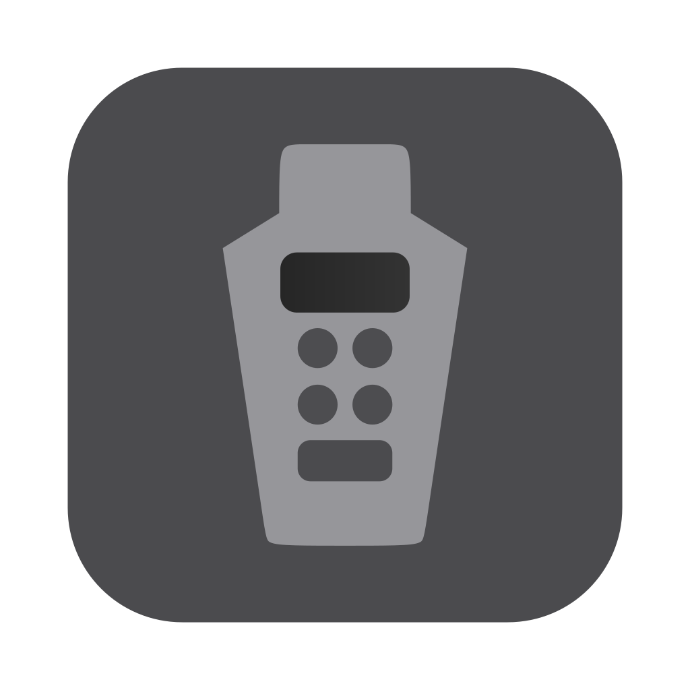

<h1 align="center">
    <br/>
    alc-calc
</h1>

<div align="center">
    <p>
        alc-calc is a GUI calculator for measuring alcoholic beverages by weight, not volume
    </p>


[](https://garnix.io/repo/camdenboren/alc-calc)


</div>

> [!NOTE]
> This project is under active development and has not yet been released, but it's usable in its current form. **Expect behavioral changes**

## Motivation

Weight-based measurement is growing in popularity for many in the kitchen, so why not apply this improved accuracy and consistency to making drinks?

The original project ([Alcohol_Weight_Calculator]) is a dead-simple Python CLI for quickly calculating the weight of ingredients in an alcoholic beverage. It has served me well, but it has notable limitations

- No input validation (shameful, I know)
- Inability to add non-alcoholic ingredients
- An emphasis on broadly categorizing ingredients handicaps precision when an ingredient's actual density is already known
- No GUI

The first three have relatively simple solutions that I could implement in a weekend, but the thought of retrofitting yet another Python GUI failed to excite me

Enter [GPUI], the UI Framework from the Zed team

- Tailwind's ease-of-use
- Rust's speed and safety
- First-class hardware acceleration

Rust rewrite with an undocumented framework it is :moyai:

## Install

### Nix

Add the following to your `flake.nix`

```nix
inputs = {
  nixpkgs = {
    url = "github:nixos/nixpkgs/nixos-unstable";
  };
  alc-calc = {
    url = "github:camdenboren/alc-calc";
    inputs.nixpkgs.follows = "nixpkgs";
  };
  ...
}
```

Then, add alc-calc to your packages

> For system wide installation in `configuration.nix`

```nix
environment.systemPackages = with pkgs; [
  inputs.alc-calc.packages.${system}.default
];
```

> For user level installation in `home.nix`

```nix
home.packages = with pkgs; [
  inputs.alc-calc.packages.${system}.default
];
```

### Non-Nix

Once released, app bundles will be distributed in the [Releases] page. Download the correct bundle for your OS/distro and follow the standard installation procedures

Until then, the only way to install alc-calc is to first build it from source by following the manual instructions in [App Bundles](#app-bundles-non-windows)

> [!NOTE]
> Though I sign both `alc-calc.app` and `alc-calc.dmg` for macOS users, you'll still need to whitelist alc-calc before installing since I'm not paying $99 to notarize binaries for something no one else uses. This can be done by attempting to open `alc-calc.dmg` then navigating to: `System Settings -> Privacy and Security -> Security`, and clicking: `Open Anyway`. Repeat this step once you attempt to run alc-calc after installing, and then you should be able to run alc-calc like normal

> [!NOTE]
> I do not sign `alc-calc_*_x64-setup.exe` for Windows users for the same reason, so you'll need to click `More Info` before installing

## Build

### Nix

Cargo is the underlying build system, _but_ Nix is the 'meta' build system

For the uninitiated, Nix reproducibly supplies all project dependencies (including rust, Darwin SDKs, custom scripts, etc.) without the need for containers. From a practical standpoint, this means any Linux or macOS user can _reliably_ run this project with a single command

```shell
nix run github:camdenboren/alc-calc
```

The `build` and `format` scripts are very useful for any contributors (these aren't directly used in CI, but they smooth out the PR process)

After cloning, you can access the development environment (including these scripts) with

```shell
nix develop
```

### App Bundles: Non-Windows

App bundles for Linux and macOS users **not** using Nix will also be provided on each release

You can generate these bundles manually by cloning and

> On Linux: adding system dependencies (tested on Ubuntu 24.04–don't use NixOS since it breaks the bundle for non-Nix users)

```shell
{
curl --proto '=https' --tlsv1.2 -sSf https://sh.rustup.rs | sh
. "$HOME/.cargo/env"
sudo apt update
sudo apt install -y pkg-config libx11-dev libx11-xcb-dev libxkbcommon-x11-dev
cargo install cargo-bundle
}
```

> On macOS: preparing the signing certificate (tested on Sequoia v15.5)

- Download imtermediate certificates: WWDR G2-G6 from [Certificate Authority]
- Create a dev certificate in XCode
  - `XCode -> Settings -> Accounts -> Manage Certificates -> + -> Apple Development`
  - Right Click Certificate -> `Export Certificate`
- Import the dev certificate in Keychain Access
  - `File -> Import Items...`
  - The 'Name' field of this cert will be the `$CERT_IDENTITY` in the next step (it can also be added to a `.env` file, which is automatically loaded via the bundle devShell)

Accessing the bundle devShell

```shell
nix develop .#bundle
```

> [!NOTE]
> The devShell is **not** required to build alc-calc, but is convenient if you're used to _the nix way_. On linux, you'll just need to install boxes (v2.3.1) and set `export CUR_OS="linux"` to execute the following commands and the associated script. On macOS, you'll also need to install rustc + cargo (v1.86) and create-dmg (v1.2.2), and set both `export CUR_OS="mac"` and `export CERT_IDENTITY="Apple Development: email (ID)"`

Then executing the script for your current OS

> For Nix

```shell
{
if [ $CUR_OS = "mac" ]; then
  cargo install cargo-bundle
  echo ""
fi
bundle-$CUR_OS
}
```

> For Non-Nix

```shell
{
if [ $CUR_OS = "mac" ]; then
  cargo install cargo-bundle
  echo ""
fi
chmod +x ./script/bundle-$CUR_OS
./script/bundle-$CUR_OS
}
```

<i>The bundle scripts are implemented sans-Nix since bundles created w/ cargo-bundle from nixpkgs link to dylibs in `/nix/store/*`, breaking the bundle for non-Nix users</i>

### App Bundles: Windows

Though cargo-bundle's Windows support is experimental (and broken for me), App bundles for Windows users will also be provided on each release via cargo-packager

You can generate these bundles manually by cloning, installing rustc + cargo (v1.86 w/ msvc) and boxes (v2.3.1), then installing cargo-packager and executing the Windows script

```powershell
cargo install cargo-packager; .\script\bundle-windows.ps1
```

### Binary Cache

You can leverage the binary cache by adding [Garnix] to your nix-config

```nix
nix.settings.substituters = [ "https://cache.garnix.io" ];
nix.settings.trusted-public-keys = [ "cache.garnix.io:CTFPyKSLcx5RMJKfLo5EEPUObbA78b0YQ2DTCJXqr9g=" ];
```

## Structure

`src` contains two crates

- The binary crate (`main`) serves only as an entry point into the library crate, which contains the UI and calculation logic

- `ui` contains the main window, with individual views and components delegated to other modules like `table`

## License

[GPLv3]

[Alcohol_Weight_Calculator]: https://github.com/camdenboren/Alcohol_Weight_Calculator
[GPUI]: https://www.gpui.rs/
[Releases]: https://github.com/camdenboren/alc-calc/releases
[Certificate Authority]: https://www.apple.com/certificateauthority/
[Garnix]: https://garnix.io/
[GPLv3]: COPYING
